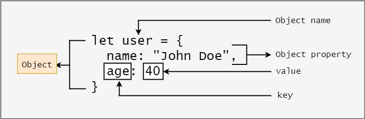

# 10장. 객체 리터럴

## 10.1 객체란?

> #### 자바스크립트는 객체(object)기반의 프로그래밍 언어, 자바스크립트를 구성하는 거의 모든 것이 객체다. 원시 값을 제외한 나머지(함수, 배열, 정규 표현식 등)은 모두 객체다.

원시 타입 - 단 하나의 값

### 객체 타입 (object/reference type)?

다양한 타입의 값(원시 값 또는 다른 객체)을 하나의 단위로 구성한 복합적인 자료구조<br>
원시타입의 값은 변경 불가능 - immutable value <br>
객체 타입의 값, 객체는 변경 가능한 값 mutable value



- JS에서 사용할 수 있는 모든 값은 프로퍼티 값이 될 수 있음.
- 함수도 일급 객체이므로, 프로퍼티 값으로 사용 가능.
- 프로퍼티 값이 함수인 경우 `method`라고 부른다. - 일반 함수와 구분하기 위해

```jsx
var counter = {
  num: 0, // property
  increase: function () {
    // method
    this.num++;
  },
};
```

- property : 객체의 상태를 나타내는 data
- method: property를 참조하고 조작할 수 있는 behavior

## 10.2 객체 리터럴에 의한 객체 생성

- C++, Java 클래스 기반 객체지향 언어는 클래스를 사전에 정의하여 `new`연산자와 함께 생성자를 호출하여 인스턴스를 호출하는 방식으로 객체 생성

> 인스턴스(Instance)? <br>
> 클래스에 의해 생성되어 메모리에 저장된 실체. <br>
> 객체지향 프로그래밍에서 객체는 클래스와 인스턴스를 포함한 개념 <br>
> 클래스는 인스턴스를 생성하기 위한 템플릿의 역할. 인스턴스는 객체가 메모리에 저장되어 실제로 존재하는 것에 초점을 맞춘 용어

#### 자바스크립트는 프로토타입 기반의 객체지향 언어

- 객체 리터럴 - 중괄호 내에 0개 이상의 프로퍼티 정의

  ```jsx
  var person = {
    name: 'Joo',
    sayHi: function () {
      console.log(`Hi, my name is ${this.name}`);
    },
  };

  console.log(typeof person); // object
  console.log(person); // { name: 'Joo', sayHi: [Function: sayHi] }
  ```

- `Object` 생성자 함수
- 생성자 함수
- `Object.create` 메서드
- 클래스(ES6)

#### 주의)

객체 리터럴의 중괄호는 코드 블록을 의미하지 않는다.코드 블록의 닫는 뒤의 중괄호에는 세미콜론을 붙이지 않는다. 하지만 객체 리터럴은 값으로 평가되는 표현식이다. 그러므로 세미콜론을 붙인다.

> **자바스크립트의 유연을 보여주는 방식**
> : 객체를 생성하기 위해 클래스를 먼저 정의하고 new 연산자와 함께 생성자를 호출할 필요 x, 단순하게 리터럴로 객체를 생성한다.

<br>

## 10.3 프로퍼티

객체는 프로퍼티의 집합이며, 프로퍼티는 키와 값으로 구성된다. <br>
프로퍼티를 나열할 때는 쉼표(,)로 구분.

- 프로퍼티 key: 빈 문자열을 포함하는 모든 문자열 또는 심벌 값.

  - 식별자 네이밍 규칙을 지키지 않을 경우에는 따옴표를 생략하면 안된다.

  ```jsx
  var person = {
    firstName: 'Somi',
    'last-name': 'Joo',
  };

  console.log(person);

  // 만약 그냥 last-name 으로 할 경우
  // SyntaxError: Unexpected token '-' 에러 발생 - 연산자가 있는 표현식으로 해석
  ```

  ```jsx
  var foo = {
    '': '',
  };

  console.log(foo); // {"" : ""}
  ```

  - 빈 문자열을 프로퍼티 키로 사용할 수는 있지만 권장x

- 프로퍼티 value: 자바스크립트에서 사용할 수 있는 모든 값

#### 프로퍼티 키 동적 생성

```jsx
var obj = {};
var key = "It's me";

obj[key] = 'Hi';

console.log(obj[key]); // Hi
```

#### 프로퍼티 키에 문자열/심벌 값 외의 값을 사용하면 암묵적 타입 변환을 통해 문자열이 된다.

```jsx
var foo = {
  1: 1,
  2: 2,
};

console.log(foo); // { '1': 1, '2': 2 }
```

#### 예약어를 키로 사용해도 에러가 발생하지 않지만, 권장x

#### 이미 존재하는 프로퍼티 키를 중복 선언하면 나중 선언된 프로퍼티가 이전 것을 덮어쓴다.

```jsx
var foo = {
  name: 'Lee',
  name: 'Joo',
};

console.log(foo); // { name: 'Joo' }
```

<br>

## 10.4 메서드

메서드 : 객체에 묶여 있는 함수 vs. 일반 함수와 구분

```jsx
var circle {
  radius : 5,   // 프로퍼티
  getDiameter : function() {      // 메서드
    return 2 * this.radius;       // 여기서 this 는 circle (객체 자신) 의미
  }
};

console.log(circle.getDiameter());    // 10
```

<br>

## 10.5 프로퍼티 접근

- 마침표 표기법(dot notation): 마침표 프로퍼티 접근 연산자(`.`)
- 대괄호 표기법(bracket notation): 대괄호 프로퍼티 접근 연산자 (`[...]`)

```jsx
var person = {
  name: 'Joo',
};

console.log(person.name); // Joo

console.log(person['name']); // Joo

console.log(person[name]); // ReferenceError: name is not defined

console.log(person.age); // undefined
```

**대괄호 표기법 - 프로퍼티 키는 반드시 따옴표로 감싼 문자열이어야 한다.** 따옴표로 감싸지 않은 key는 찾지 못해서 `ReferenceError`가 발생한다.
<br>
**객체에 존재하지 않는 프로퍼티에 접근하지 못하면 `undefined`를 반환한다.**

<br>

```jsx

var person = {
  'last-name' : 'Lee',
  1 : 10
};

person.'last-name';      // SyntaxError
person.last-name;        // 브라우저 환경 : NaN
                         // Node.js 환경 : ReferenceError

person[last-name];       // ReferenceError
person['last-name'];     // "Lee"

// 프로퍼티 키가 숫자로 이뤄진 문자열인 경우 따옴표 생략 가능
person.1;                // SyntaxError
person.'1';              // SyntaxError
person[1];               // 10 : person[1] -> person['1']
person['1'];             // 10
```

#### 퀴즈) `person.last-name` Node.js 환경에서는 ReferenceError인데, 브라우저에서는 NaN인 이유?

자바스크립트 엔진은 먼저 `person.last`를 평가하게 된다. `person` 객체에는 `last`인 프로퍼티 키가 없기 떄문에 `undefined`로 평가된다. 따라서 `person.last-name` 은 `undefined` - `name`과 같다. <br>
이후 `name`이라는 식별자를 찾게 되는데, 해당선언이 없으므로 `ReferenceError: name is not defined` 에러가 발생한다. <br>
하지만 브라우저 환경에서는 `name`이라는 전역변수(전역 객체 window의 프로퍼티)가 암묵적으로 존재한다. 기본값은 빈 문자열. 따라서 `person.last-name`은 `undefined` - ''와 같으므로 `NaN`이 된다.

<br>

## 10.6 프로펕치 값 갱신

이미 존재하는 프로퍼티에 값 할당하면 프로퍼티 값 갱신

```jsx
var person = {
  name: 'lee',
};

person.name = 'joo';

console.log(person); // { name: 'joo' }
```

<br>

## 10.7 프로퍼티 동적 생성

존재하지 않는 프로퍼티에 값을 할당하면 프로퍼티가 동적으로 생성되어 추가됨.

```jsx
var person = {
  name: 'lee',
};

person.age = 20;

console.log(person); // { name: 'lee', age: 20 }
```

<br>

## 10.8 프로퍼티 삭제

`delete` 연산자 - 만약 존재하지 않는 프로퍼티를 삭제하면 아무런 에러없이 무시됨.

```jsx
delete person.age; // 프로퍼티 삭제

delete person.address; // 프로퍼티 존재 x - 에러가 발생하지 않음

console.log(person); // { name: 'lee' }
```

 <br>

## 10.9 ES6에서 추가된 객체 리터럴의 확장 기능

### 10.9.1 프로퍼티의 축약 표현

```jsx
// ES5
var x = 1,
  y = 2;

var obj = {
  x: x,
  y: y,
};

console.log(obj); // { x: 1, y: 2 }
```

```jsx
//ES6
let x = 1,
  y = 2;

const obj = { x, y };
console.log(obj); // { x: 1, y: 2 }
```

- ES6에서는 프로퍼티 값으로 변수를 사용하는 경우 변수 이름과 프로퍼티 키 값이 동일한 이름일 때 프로퍼티 키 생략 가능(Properly shorthand)

### 10.9.2 계산된 프로퍼티 이름

문자열/문자열로 타입 변환될 수 있는 값으로 평가되는 표현식을 사용해 키를 동적 생성 가능. 단 키로 사용할 표현식을 대괄호로 묶어야 함.

```jsx
//ES5
var prefix = 'prop';
var i = 0;

var obj = {};

obj[prefix + '-' + ++i] = i;
obj[prefix + '-' + ++i] = i;
obj[prefix + '-' + ++i] = i;

console.log(obj); // { 'prop-1': 1, 'prop-2': 2, 'prop-3': 3 }
```

```jsx
//ES6
const prefix = 'prop';
let i = 0;

// 객체 리터럴 내부에서 계산된 프로퍼티 이름으로 키 동적 생성
const obj = {
  [`${prefix}-${++i}`]: i,
  [`${prefix}-${++i}`]: i,
  [`${prefix}-${++i}`]: i,
};

console.log(obj); // { 'prop-1': 1, 'prop-2': 2, 'prop-3': 3 }
```

### 10.9.3 메서드 축약 표현

```jsx
//ES5
var obj = {
  name: 'lee',
  sayHi: function () {
    console.log('hi ' + this.name);
  },
};

obj.sayHi(); // hi lee
```

```jsx
//ES6
var obj = {
  name: 'lee',
  sayHi() {
    console.log('hi ' + this.name);
  },
};

obj.sayHi(); // hi lee
```

ES6에서는 메서드 정의 시 function 키워드 생략 가능
