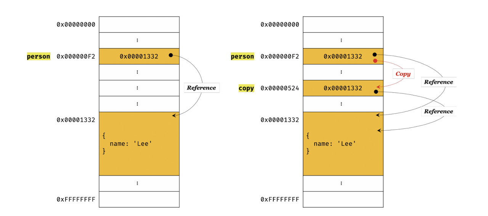

# 11장. 원시 값과 객체의 비교

원시 타입과 객체 타입의 3가지 차이

- 원시 값은 변경 불가능(immutable value) vs. 객체는 변경 가능(mutable)
- 원시 값을 변수에 할당하면 변수(확보된 메모리 공간)엔느 실제 값이 저장됨. <br>
  객체를 변수에 할당하면 변수에는 참조 값이 저장
- 원시 값을 갖는 변수를 다른 변수에 할당하면 원본의 원시 값이 복사되어 전달 (값에 의한 전달, pass by value)<br>
  객체를 가리키는 변수를 다른 변수에 할당하면, 원본의 참조 값이 복사되어 전달(참조에 의한 전달, pass by reference)

## 11.1 원시 값

### 11.1 변경 불가능한 값

#### 원시 값은 Read-Only, 변경 불가능한 값 <br>

- 변수는 하나의 값을 저장하기 위해 확보된 메모리 공간 자체, 메모리 공간을 식별하기 위해 붙인 이름
- 값 : 변수에 저장된 데이터, 표현식이 평가되어 생성된 결과
  **값이 변경 불가능한 것**

  > 변수는 언제든지 재할당을 통해 변수 값을 교체할 수 있음.
  > 원시값은 변경 불가능하다 = 원시 값 자체를 변경할 수 없다 != 변수 값을 변경할 수 없다

- 상수: 재할당이 금지된 변수, 단 한 번만 할당이 허용

```jsx
// const 키워드를 사용하여 선언한 변수는 재할당x
const o = {};

// const 키워드를 사용하여 선언한 변수에 할당한 원시 값 (상수) 은 변경 X
// const 키워드를 사용하여 선언한 변수에 할당한 객체는 변경 가능
o.a = 1;
console.log(o); // {a : 1}
```

#### 원시 값은 변경이 불가능한 값이기 때문에, 변수 값을 변경하려면, 새로운 메모리 공간을 확보하고 재할당한 값을 저장한 후 변수가 참조하던 메모리 공간의 주소를 변경한다. - 값의 불변성(immutablity)


#### 재할당 외에 변수 값을 변경할 수 있는 방법이 없다.

 <br>

### 11.1.2 문자열과 불변성

원시 값 저장하려면 먼저 확보해야 하는 메모리의 크기를 결정해야 함.
문자열은 0개 이상의 문자로 이루어진 집합, 1개의 문자는 2바이트의 메모리 공간에 저장됨.

문자열은 몇 개의 문자로 이루어졌냐에 따라 메모리 공간의 크기가 결정됨.
1개의 문자 - 2바이트, 20개의 문자 - 20바이트가 필요하다.

#### 유사 배열 객체 (array-like object)

문자열은 유사 배열, 마치 배열처럼 인덱스를 통해 접근 가능, length 프로퍼티를 가짐.
원시값을 객체처럼 사용하면 원시값을 감싸는 래퍼 객체로 자동 변환된다.

```jsx
var str = 'string';

str[0] = 'S'; // 원시 값이기 때문에 변경할 수 없다. 에러 발생 X

console.log(str[0]); // s

console.log(str.length); // 6
console.log(str.toUpperCase()); // STRING
```

<br>

### 11.1.3 값에 의한 전달

```jsx
var score = 80;
var copy = score;

console.log(score); // 80
console.log(copy); // 80

score = 100;

console.log(score); // 100
console.log(copy); // 80
```

#### 변수에 변수를 할당했을 때 무엇이 전달되는가?

**값에 의한 전달**:
할당받는 변수, copy는 할당되는 변수, score의 원시 값이 복사되어 전달된다.
원시값 80이 복사되어 전달된다.
<br>
하지만 score, copy 변수의 값 80은 다른 메모리 공간에 저장된 별개의 값이다.

```jsx
var score = 80;

var copy = score;

console.log(score, copy); // 80 80
console.log(score === copy); // true

score = 100;
console.log(score, copy); // 100 80
console.log(score === copy); // false
// score 변수의 값을 변경해도 copy 변수의 값에는 아무런 영향을 주지 않는다.
// 서로 다른 메모리 공간에 저장된 별개의 값이다.
```

참고) 파이썬의 경우 두 변수가 같은 원시 값을 참조하다가, 어느 한쪽의 변수에 재할당이 이루어지면 그 때 새로운 메모리 공간에 재할당된 값을 저장한다.

```py
score = 10
copy = score

print(id(score) == id(copy))  # True
```

<br>

## 11.2 객체

### 11.2.1 변경 가능한 값

객체 타입은 변경 가능한 값, mutable value
객체를 할당한 변수는 재할당 없이 객체를 직접 변경할 수 있다. 재할당 없이 프로퍼티를 동적 추가 가능, 프로퍼티 값 갱신 가능, 프로퍼티 삭제 가능

<p align="center">
  
</p>

- 이때 객체를 할당한 변수에 재할당하지는 않았으므로, 객체를 할당한 변수의 참조값은 변하지 않는다.

- 객체의 구조적 단점: 원시 값과 다르게 여러 개의 식별자가 하나의 객체를 공유할 수 있다.

#### 참고) 자바스크립트의 객체 관리 방식

> - 대부분의 자바스크립트 엔진은 해쉬 테이블(프로퍼티 키를 인덱스로 사용)과 유사하지만 높은 성능을 위해 더 나은 방법으로 객체를 구현
> - V8 자바스크립트 엔진에서는 프로퍼티에 접근하기 위해 동적 탐색 대신 히든 클래스 방식을 사용

#### 얕은 복사 vs 깊은 복사

- shallow copy : 객체의 첫 번째 수준에 있는 프로퍼티만 복사 - 중첩된 객체의 참조만 복사
- deep copy: 객체의 모든 수준(중첩된 객체 포함)을 완전히 새로운 메모리에 복사

```jsx
const o = { x: { y: 1 } };

const c1 = { ...o }; // 얕은 복사
console.log(c1 === o); // false
console.log(c1.x === o.x); // true
// c1과 o는 다른 객체지만 내부 x프로퍼티는
// 동일한 내부 객체를 가리킴

// cloneDeep을 사용하 깊은 복사
const _ = require('lodash');

const c2 = _.cloneDeep(o);
console.log(c2 === o); // false
// 완전히 독립적인 객체
console.log(c2.x === o.x); // false
```

```jsx
const v = 1;

const c1 = v;
console.log(c1 === v); // true
// 원시 값의 경우, 항상 값 자체가 복사되어 깊은 복사와 같은 효과

const o = { x: 1 };

// 참조 복사
const c2 = o;
console.log(c2 === o); // true
// 객체의 경우, 변수에 할당할 때 참조만 복사되어 얕은 복사와 같은 효과
```

<br>

### 11.2.2 참조에 의한 전달

```jsx
var person = {
  name: 'joo',
};

var copy = person; // 참조 복사
console.log(copy === person); // true
// 같은 객체를 가리키므로 true
```

```jsx
var person = { name: 'joo' };
var copy = { ...person }; // 얕은 복사
// 새로운 객체가 생성되어 copy에 할당
console.log(copy === person); // false
```


참조에 의한 전달: 객체를 가리키는 변수, person을 다른 변수, copy에 할당하면 원본의 참조 값이 복사되어 전달됨.

- 두 개의 식별자가 하나의 객체를 공유, 어느 한 쪽에서 객체를 변경하면 서로 영향을 받는다.

```jsx
var person = {
  name: 'lee',
};

var copy = person; // 동일한 참조값을 갖는다.

console.log(copy === person); // true

copy.name = 'kim';

person.address = 'seoul';

console.log(person); // { name: 'kim', address: 'seoul' }
console.log(copy); // { name: 'kim', address: 'seoul' }
```

#### 퀴즈)

```jsx
var person1 = {
  name: 'lee',
};

var person2 = {
  name: 'lee',
};

console.log(person1 === person2); // false
// 다른 메모리에 저장된 별개의 객체이기 때문에
console.log(person1.name === person2.name); // true
// 값으로 평가되는 표현식 -  원시값은 같아서 true
```
