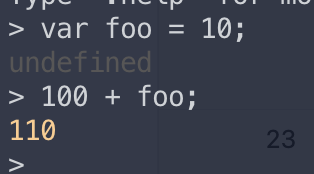

### 목차
▣ 05장: 표현식과 문  
5.1 값  
5.2 리터럴  
5.3 표현식  
5.4 문  
5.5 세미콜론과 세미콜론 자동 삽입 기능  
5.6 표현식인 문과 표현식이 아닌 문

### 5.1 값
- 표현식이 평가되어 생성된 결과를 말한다.
- 모든 값은 데이터 타입을 가지며, 메모리에 2진수 bit로 저장된다.
- 변수는 하나의 값을 저장하기 위해 확보한 메모리 공간을 식별하기 위한 이름으로, **변수에는 값이 할당된다.**
- `var sum = 10 + 20;`
	- 해당 코드에서 sum에 30이 할당되는데, 30이 저장되려면 10 + 20은 할당 이전에 평가되어 값을 생성해야 한다.
- 값은 다양한 방법으로 생성할 수 있다.

### 5.2 리터럴
- 사람이 이해할 수 있는 문자 또는 약속된 기호를 사용해 값을 생성하는 표기법(notation)
	- 아라비아 숫자, 알파벳, 한글
	- 미리 약속된 기호 - "", ., [], {}, // 등..
- js 코드에 "3"을 쓰면, js 엔진은 이를 평가해 메모리에 숫자 3을 생성한다 (11)
- 8진수, 16진수 리터럴은 ES6부터 추가
- 정규표현식도 리터럴

### 5.3 표현식
- 표현식(expression)은 값으로 평가될 수 있는 문(statement)이다.
- 표현식이 평가되면 새로운 값을 생성하거나 기존 값을 참조한다.
- **리터럴** 은 값으로 평가되기에 리터럴도 표현식이다.
```js
// literal
10
'hello'

// 식별자 표현식 (사용하는 경우, 선언이 이미 존재)
sum
person.name
arr[1]

// 연산자 표현식
10 + 20
sum = 10
sum !== 10

//함수/메서드 호출 표현식 (선언이 이미 존재)
square();
person.getName();
```
- 모두 값으로 표현될 수 있기에 표현식!
- 이 때 표현식과 표현식이 평가된 값은 동등한 관계, 즉 동치 equivalent 다.
	- 1 + 2에서 1 + 2와 3은 동치
- 즉 표현식은 값처럼 사용할 수 있다. 값이 올 수 있는 자리에는 표현식도 올 수 있다.

### 5.4 문
- 문statements 과 표현식expression 을 구분하면 js 엔진에서 코드를 읽을 수 있고, 실행 결과를 예측할 수 있다.
- 문은 프로그램을 구성하는 기본 단위이자 최소 실행 단위이다. 프로그램은 문의 집합, 문을 작성하고 순서에 맞춰 나열하는 것이 프로그래밍.
- 문은 여러 토큰으로 구성된다. 토큰이란 문법적 의미를 가지며, 문법적으로 더 이상 나눌 수 엇ㅂ는 코드의 기본 요소를 의미한다. 세미콜론 온점 연산자 등등
- 문은 명령문이라고도 부른다. 
- 선언문, 할당문, 조건문, 반복문 등이 있다.

### 5.5 세미콜론과 세미콜론 자동 삽입 기능
- 세미콜론은 문의 종료를 나타낸다.
- 0개 이상의 문을 중괄호로 묶는 코드블록 {...} 은 자체 종결성 self closing을 갖기 때문에 세미콜론을 붙이지 않는다.
- js 엔진은 문의 끝이라고 예측되는 지점에 세미콜론을 자동으로 붙여주는 세미콜론 자동 삽입기능 (ASI - automatic semicolon insertion)을 암묵적으로 수행한다.
- 그러나 개발자의 예측과 다르게 붙여지는 경우가 있으므로 세미콜론 사용이 권장됨.

###  표현식인 문과 표현식이 아닌 문
- 표현식은 문의 일부일 수도 있고, 그 자체로 문이 될 수도 있다.
```js
// 변수 선언문은 값으로 평가될 수 없으므로 표현식이 아니다.
var x;
// 1, 2, 1 + 2, x = 1 + 2 는 모두 표현식이다.
x = 1 + 2; // 표현식이면서 완전한 문.
```

- 변수에 할당이 되면 표현식, 안되면 표현식이 아닌 문이다.
```js
var foo = var x; // SyntaxError: Unexpected token var
```
변수 선언문 `var x`는 값으로 표현될 수 없고, 표현식이 아니다.
```js
var x
x = 100;
```
할당문 `x = 100`은 그 자체가 표현식이다. 값처럼 사용할 수 있다.
`var foo = x = 100` 가능

> 완료 값 completion value
> 크롬 개발자 도구에서 표현식이 아닌 문을 실행하면 언제나 undefined를 출력한다. 이를 완료 값이라 한다. 완료 값은 표현식의 평가 결과가 아니다. 따라서 다른 값과 같이 변수에 할당할 수 없고 참조할 수도 없다.
> 표현식인 문을 실행하면, 언제나 평가된 값을 반환한다.
> 
> ]
> 
> undefined가 맨날 나오는 이유!